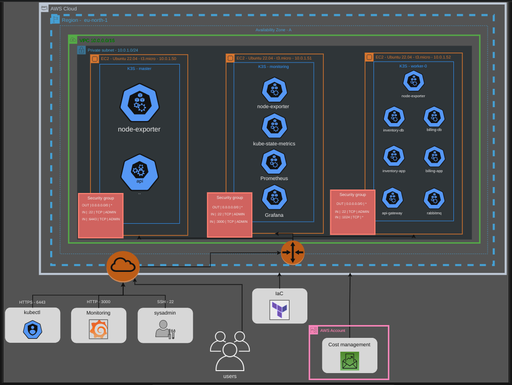

<!-- ctrl + shift + v to preview -->
# kubernetes-microservice-architecture

## Table of Contents
- [kubernetes-microservice-architecture](#kubernetes-microservice-architecture)
  - [Table of Contents](#table-of-contents)
  - [General Information](#general-information)
  - [Features](#features)
  - [Technologies Used](#technologies-used)
  - [Team \& My Work](#team--my-work)
  - [Main Learnings](#main-learnings)
  - [Setup](#setup)

## General Information
This project was made as a school project in [kood/Jõhvi](https://kood.tech/) (5.8.2023)

The project required me to deploy a [previously](https://github.com/JesusKris/vagrant-microservice-architecture) created microservice architecture which included a gateway, a message queue system RabbitMQ & 2 other services with their own PostgreSQL instances, using K3s to the AWS Cloud.

K3S is a lightweight version of K8s which has been stripped of many non primary features. It makes it a perfect tool to test things locally or the application does not require a powerhouse such as K8s. 

The cloud infrastructure is provisioned using IaC tool called Terraform.

I was required to push microservices docker images to Dockerhub, build k8s manifests for each microservice and create a quick deployment using Vagrant.

The cluster is managed using a CLI tool **kubectl**. kubectl is used from the host machine.



  **NB! Different source control platform was used hence no commit history.**

## Features
- Microservice architecture
- K3s powered cluster
- Automatic infrastrcture provisioning using Terraform
- Message queue system

## Technologies Used

[K3S](https://k3s.io/)

[Terraform](https://www.terraform.io/)

[Dockerhub](https://hub.docker.com/)

[Docker](https://www.docker.com/)

[kubectl](https://kubernetes.io/docs/tasks/tools/)

[AWS](https://aws.amazon.com/)

## Team & My Work
This was a solo project.

I did everything myself.

## Main Learnings
- Basics of Terraform
- Basics of AWS Cloud
- Basics of kubernetes components, networking, manifests
- kubectl

## Setup
Clone the repository
```
git clone https://github.com/JesusKris/cloud-microservice-architecture.git
```
- Create an AWS Account
- Create a security key in AWS EC2 and call it k3s-cluster.pem. Make sure to import it in the root of this project.
- Create an access key in security credentials, rename .env-example to .env and fill out the required fields.
- Install kubectl
- Install Terraform
  
Give executable rights to **terraform.sh**
```sh
chmod +x terraform.sh
```

Run **terraform init** in ./**infrastructure_as_code dir**

Rename **terraform.tfvars.example** to  **terraform.tfvars** in ./**infrastructure_as_code** dir and fill out the required variables

Run **terraform.sh** using first_apply argument and follow the prompts
```sh
./terraform.sh first_apply
```

Following endpoints will be made available:
```
Every EC2 instance: ssh -i {path to .pem file} ubuntu@{public ipv4}

Grafana dashboard: In browser http://{k3s_monitoring public ipv4}:30000

API endpoint: http://{k3s_worker-0 public ipv4}:31000/api/{movies|billing/*}
```

To destroy the infrastructure, run:
```sh
./terraform.sh force_destroy
```